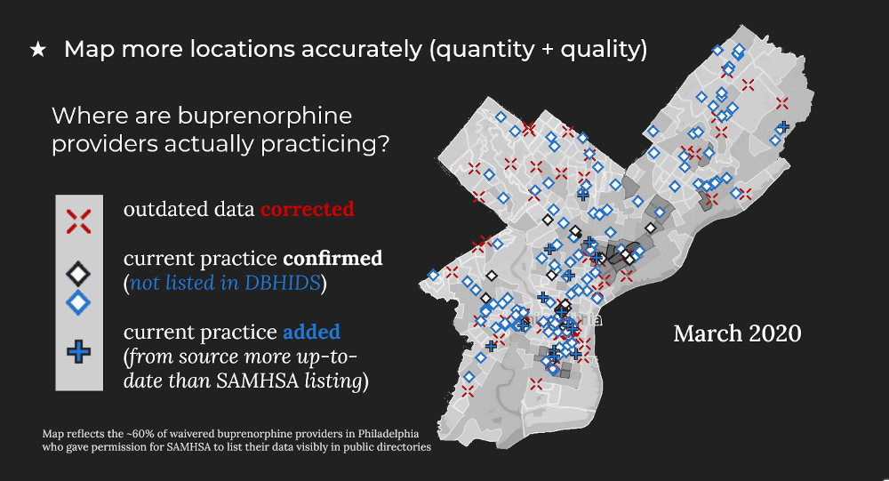
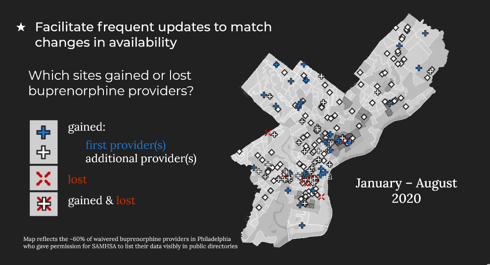
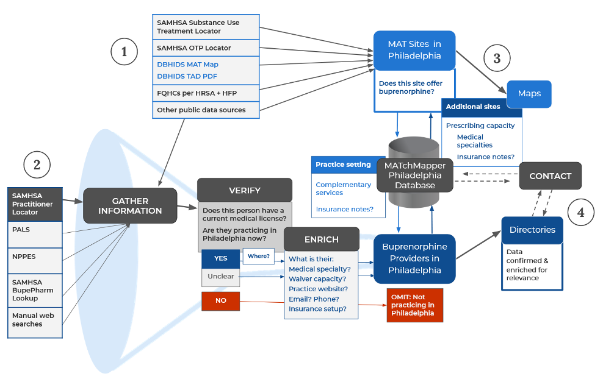
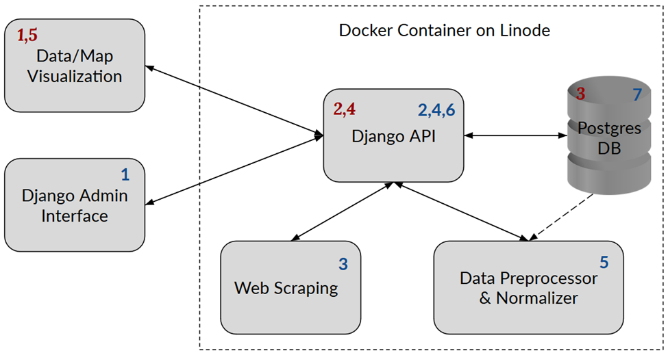

# MATchMapper

* [Project history](#project-history)
* [Current priorities](#current-priorities)
* [Data sources and pipeline](#data-sources-and-pipeline)
* [Tech stack](#tech-stack)

## Project history

Philadelphia is among the cities [hardest hit by the opioid crisis](https://www1.pewtrusts.org/en/research-and-analysis/articles/2019/08/06/poll-shows-impact-of-opioid-crisis-on-philadelphians-and-their-neighborhoods). Medication-assisted treatment (MAT), particularly [buprenorphine](https://dbhids.org/addiction-services/bupe-works), is identified as [“the gold standard of care” for opioid use disorder](https://www1.pewtrusts.org/en/research-and-analysis/articles/2021/02/04/how-pew-is-helping-to-address-philadelphias-pandemic-intensified-opioid-crisis).

In early 2020, several local tech communities partnered with public health organizations to host a [seven-week data hackathon](https://codeforphilly.github.io/datahack2020/), right before the COVID-19 pandemic shut down in-person gatherings. [Team 8](https://github.com/CodeForPhilly/datahack2020/tree/master/analyses/team08) responded to the [orientation request](https://docs.google.com/presentation/d/13b7B2cbtGbvr2khBgXWmsVvrmM1Lc2WFgBqmpLp8HEI/edit#slide=id.g76c262679b_0_11) from [Health Federation’s Opioid Response Program](https://healthfederation.org/training/opioid-epidemic-response-training): “Can you help us identify what buprenorphine access really looks like in Philadelphia?” by mapping public data on availability and need.

We discovered that [information about MAT availability is rich but scattered](https://docs.google.com/presentation/d/16nwH2U0QIZCxcHsgCmXB3cyPEW6DET5V0EYuNGPLqo0/edit#slide=id.g7f29ef6fd5_1_37). Each key source left out some listings from the others, and a substantial percentage of provider listings were out of date.

## Current priorities

### WHY
We want to reduce the human costs of inaccurate and dispersed data. Red Xs below mark dead ends: listings where treatment seekers might give up from disappointment or frustration. Blue icons show examples where searchers would miss out on key treatment options, depending on which source they used:

### FOR WHOM
* Help the helpers! 
Examples: People who answer the substance-abuse hotline, help with emergency room discharge, help with post-prison reentry, other referral networks ...

### HOW
Make it easier for helpers to find relevant options for people seeking MAT, and waste less time with unreliable information.
* Centralize relevant site listings
* Correct legacy errors / false positives
* Organize search & filter options by relevant priorities (user feedback especially wanted here!)
* Facilitate frequent updates:

## Data sources and pipeline

At the national level, SAMHSA (the Substance Abuse and Mental Health Services Administration) maintains several search tools with different details. At the local level, DBHIDS (Philadelphia’s Department of Behavioral Health and Individual disAbility Services) offers an MAT page with a “Treatment Availability Database” PDF updated 2–3x weekly for bed availability but far less frequently for other changing details.

After the hackathon, we focused first on identifying how Health Federation could contact individual providers about buprenorphine waiver training (parts 2 & 4 in below diagram). In 2021, our project has  shifted to mapping sites that offer any MAT medication, with filters and info popups for other relevant factors (parts 1 & 3):

For **data update** components and sequence, see blue numbers (sans serif). For **data access** setup, see red numbers (serif).

## Tech stack
* Django 3.1
* PostgreSQL 9.6.3
* pgadmin 4.23
* R Shiny
* Figma => HTML5, CSS3 ...

## How to use

Start virtualenv and run pipenv shell to use virtual environment. Contact the team at matchmapper.philadelphia@gmail.com to get access to the Django application and the PostgreSQL database.
